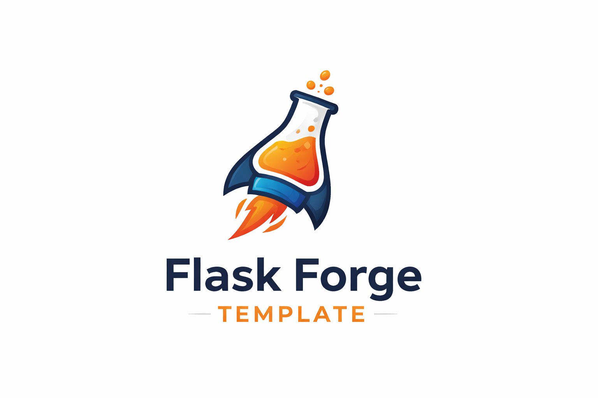

<p align="center">
    
</p>

<h1 align="center">Flask Forge Template</h1>

<p align="center">
A production-oriented Flask starter for teams that want authentication, RBAC, migrations, tests, and Docker setup from day one.
</p>

---

## Overview

`flask-forge-template` is a backend template maintained by **Ali Zeiynali** for quickly bootstrapping real Flask services.

Instead of spending the first week rebuilding auth, users, migrations, and project structure, you can clone this template and start implementing product logic immediately.

Repository: https://github.com/Ali-zeiynali/flask-forge-template  
Maintainer: Ali Zeiynali  
Contact: Azeiynali@gmail.com

## What is implemented

This repository currently includes:

- Flask application factory with config classes (`development`, `testing`, `production`)
- JWT auth endpoints (`register`, `login`, `refresh`, `logout`, `me`)
- Role and permission based access control with decorators
- Users API with service/repository/schema layering in `src/api/v1/users`
- Admin API for managing roles/permissions and assignments
- Database integration with SQLAlchemy + Flask-Migrate/Alembic
- Landing page at `/` with quick status cards
- Test suite (auth, admin, users, health, web)
- Linting/formatting/security scripts and GitHub CI workflow
- Dockerfile + docker-compose for containerized runs

## Project layout

```text
src/
    app.py                      # Flask app factory
    flaskforge/wsgi.py          # Canonical Flask CLI/Gunicorn entrypoint
    cli.py                      # Custom `flask forge ...` commands
    config.py                   # Config and env var mapping
    models.py                   # SQLAlchemy models (User/Role/Permission)
    api/v1/                     # Versioned API modules
    core/                       # Shared authz/errors/security/response helpers
    extensions/                 # DB, JWT, migrate, CORS, security headers
    web/                        # Landing page blueprint and templates
    migrations/                 # Alembic migration scripts

docs/                           # Detailed guides
scripts/                        # Bootstrap/test/lint/format/audit helpers
tests/                          # Pytest test suite
```

## Quickstart (local development)

### Prerequisites

- Python 3.12+
- Git

### macOS / Linux (bash)

```bash
bash scripts/bootstrap.sh
```

What the script does:

1. Creates `.venv` if missing
2. Installs package + dev dependencies
3. Creates `.env` from `.env.example` when needed
4. Runs DB migrations
5. Seeds RBAC data
6. Optionally prompts to create an admin user

Then start the server:

```bash
source .venv/bin/activate
python -m flask --app flaskforge.wsgi:app run --debug
```

### Windows (PowerShell)

```powershell
powershell -ExecutionPolicy Bypass -File .\scripts\bootstrap.ps1
```

Then start the server:

```powershell
.\.venv\Scripts\Activate.ps1
python -m flask --app flaskforge.wsgi:app run --debug
```

### Verify the app is running

- Landing page: http://127.0.0.1:5000
- Health API: http://127.0.0.1:5000/api/health
- Versioned health API: http://127.0.0.1:5000/api/v1/health

## Docker and docker-compose

### Docker

```bash
docker build -t flask-forge-template .
docker run --rm -p 8000:8000 --env-file .env flask-forge-template
```

Open:

- http://127.0.0.1:8000/
- http://127.0.0.1:8000/api/health

### docker-compose

```bash
docker compose up --build
```

`docker-compose.yml` runs migrations before starting Gunicorn, so the API should be usable after startup logs settle.

## Configuration model

Configuration is read from environment variables in `src/config.py`.

- Copy `.env.example` to `.env`
- Override values based on your environment
- `APP_ENV` controls config class selection (`development`, `testing`, `production`)

Important variables:

- `SECRET_KEY`, `JWT_SECRET_KEY`
- `DATABASE_URL`
- `JWT_ACCESS_EXPIRES`, `JWT_REFRESH_EXPIRES`
- `CORS_ORIGINS`
- `SECURITY_HEADERS_ENABLED`, `FORCE_HTTPS`, `ENABLE_HSTS`
- `DOCS_URL`, `GITHUB_URL`, `CI_STATUS` (used by landing page)

## Day-to-day development commands

```bash
# lint
bash scripts/lint.sh

# format
bash scripts/format.sh

# tests + coverage
bash scripts/test.sh

# security checks
bash scripts/audit.sh

# migrations + seed only
bash scripts/init_db.sh
```

## Database, migrations, seed, admin

```bash
python -m flask --app flaskforge.wsgi:app db upgrade
python -m flask --app flaskforge.wsgi:app forge seed
python -m flask --app flaskforge.wsgi:app forge create-admin --email admin@yourdomain.com --password '<strong-password>' --full-name 'Admin User'
```

## Next steps after generating your own project

1. Rename package/app metadata (`APP_NAME`, `APP_VERSION`, docs title).
2. Change secrets and database settings in `.env`.
3. Customize RBAC defaults in `src/cli.py` (`DEFAULT_ROLE_PERMISSIONS`).
4. Implement your domain modules using the `route -> schema -> service -> repo` structure under `src/api/v1`.
5. Replace landing page links (`DOCS_URL`, `GITHUB_URL`) and update template branding.
6. Add project-specific CI checks and deployment targets.

## Documentation map

- [Documentation index](docs/index.md)
- [Development guide](docs/development.md)
- [Configuration guide](docs/configuration.md)
- [API guide](docs/api.md)
- [Authentication guide](docs/auth.md)
- [RBAC guide](docs/rbac.md)
- [CLI guide](docs/cli.md)
- [Testing guide](docs/testing.md)
- [Deployment guide](docs/deployment.md)
- [Security guide](docs/security.md)

## Contributing and security

- Contribution process: [CONTRIBUTING.md](CONTRIBUTING.md)
- Security reporting: [SECURITY.md](SECURITY.md)
- Community standards: [CODE_OF_CONDUCT.md](CODE_OF_CONDUCT.md)

## License

MIT — see [LICENSE](LICENSE).
